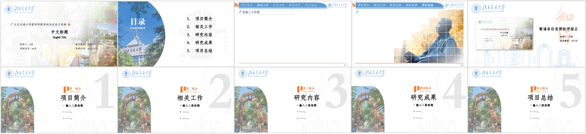
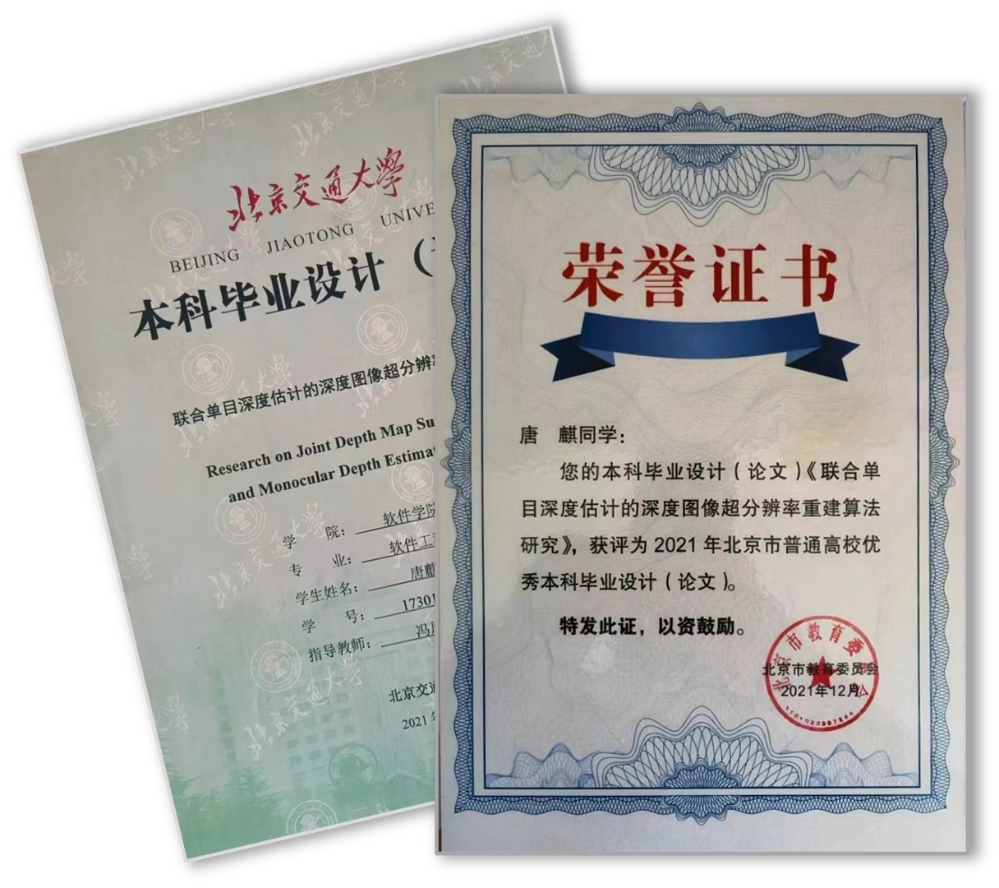
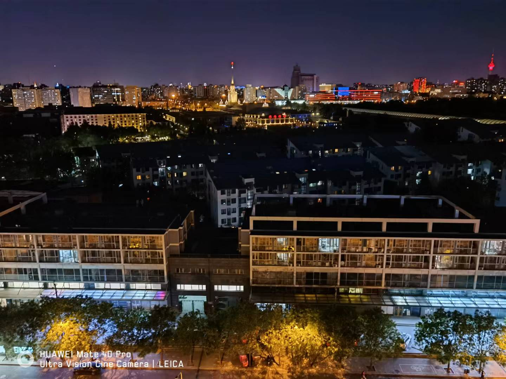

# 📦 一个 BJTUer 毕设的仓库

## 写在前面

最近有幸看到了 <a href="https://www.doublez.site">doubleZ</a> 的 <a href="https://github.com/doubleZ0108/TJ-Graduation-Project-2021">一个关于同济er毕设的仓库</a>，很喜欢这样的工作。看着手机为我整理的去年今日拍的毕业照，便想将过去一年、也是本科四年的答卷好好整理一番。

## 文件结构

- 🗃️ archive 存档
  - 📄 document 任务书、开题报告、毕业论文
  - 🖥️ presentation 答辩 PPT
- 🎓 bjtu-ppt PPT 模板
- 🎓 bjtu-beamer Beamer 模板 <a href="https://github.com/Tang1705/BJTU-Beamer">【Latest Version】</a>
- 🎓 bjtu-bachelor-thesis LaTeX 模板 <a href="https://github.com/Tang1705/BJTU-Bachelor-Thesis">【Latest Version】</a>
- 🎉 bridgenet 英文论文
- 📝 paper-reading 周报

## 关于模板

毕设答辩的 PPT 是在网络资源的基础上改进、制作的，所用校园图片都是我自己拍摄的。这里提供的模板在毕设 PPT 的基础上对母版进行了制作。与网络上"北京交通大学同学专属"的 PPT 模板不同，原作者的设计不是仅仅在大众化的模板上加了校徽，而是在整体设计风格上都紧扣"交通"和"交大"的主题，而且简约不失美观，这也是我选择他作为毕设答辩 PPT 模板的初衷。

在这段整理、制作的时间里，我也复刻出了一套这一风格的 Beamer 主题。由于水平有限，当前版本重在实现原 PPT 模板的风格，远不及 SJTU-Beamer 的代码优良、文档丰富，感兴趣的友人可以去学习借鉴。也欢迎喜欢该主题风格的朋友基于当前版本改进

LaTeX 模板是在 <a href="https://github.com/paulzhn">paulzhn</a> 的工作 <a href="https://github.com/paulzhn/bjtu-bachelor-thesis">bjtu-bachelor-thesis</a> 的基础上修改的，对封面、文件结构、命令进行了修改，并提供了一些使用示例。但不建议使用 LaTeX 对本科论文进行排版，虽然 LaTeX 和 Word 相比更容易进行样式管理，但在官方模板发布之前，所有非官方的模板都仅供参考和二次开发。此外， Word 编写的论文更便于指导老师进行批注和修改，且为北京交通大学本科生毕业设计（论文）规范中的要求。

## 写在最后

谨以此作为我那最开心几年的毕业礼物 🎁

很开心在新年之前收到啦，有幸荣获 🏆 北京市普通高校优秀本科毕业设计（论文）

时隔一年，想起那段四个人写论文的日子，还是会无比怀念。夜晚、投影、音乐剧、论文、调酒、制冰机、高粱怡、炸豆腐……怎么能不怀念呢？

最后，尤其要感谢 Mr. 张，全程拍摄了我的毕设答辩，是一段很珍贵的视频。

<!--https://user-images.githubusercontent.com/44370086/170417273-ee8ea824-ed0f-475b-a699-0e817d7e4013.mp4-->

  [1]: https://github.com/Tang1705/BJTU-Bachelor-Thesis
